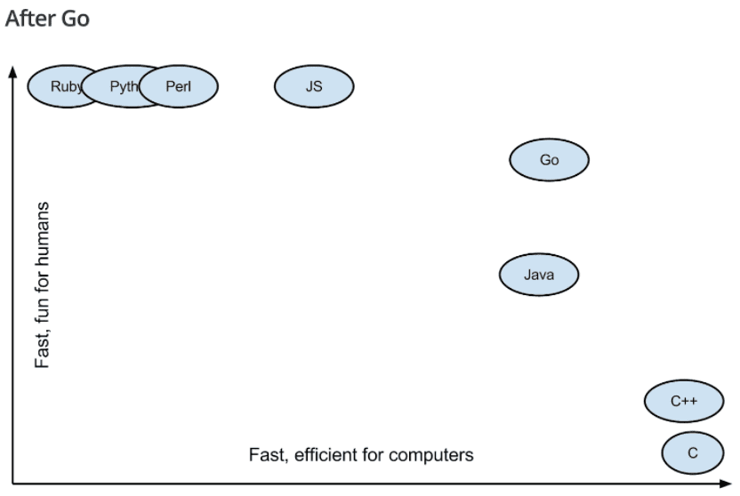
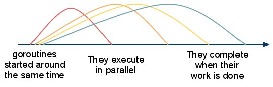

"Go is an open source programming language that makes it easy to build simple, reliable, and efficient software.". In past couple of years, there is a rise of Golang in terms of community driven
projects and users in general. Most people claim it as a langauge of the future.
Created and backed by Google, Golang is a modern programming language created to facilitate backend
development. Since Golang is new, the creators have put most of their effort in learning from the
setbacks of previous programming language to provide a convenient writing scheme and also a faster
compile time while running it.

# Why does Golang stand out?
By now, there are over 700 official programming languages according to wikipedia, so there should
be a fair reason why Golang stands out from most of them. According to my perspective, the choice of
programming language should depend upon the use case that you are dealing with, hence if we compare
golang with languages used in frontend web development, then it will be of no use. Golang really
shines in the backend development or the server side. The main advantage of golang is that it introduces the ability to leverage multiple cores in your system, dramatically improving performance.
Golang is a blend of languages that are syntactically easy to write such as Python with the same execution speed as in C.
Other advantages of Golang are:
- Belonging to the family of C, Golang is much closer to the underlying hardware, which increases the performance as there is no conversion to intermediate byte code.
- Golang is different, it doesn't natively support the Object Oriented design principles, making the code easy to maintain. I personally do not mind classes and Object oriented design but they add too much overhead in terms of complexity at some point of time.
- The community is constantly growing and Golang is backed by Google!

## Goroutines
With parallelism an already introduced concept in traditional languages, Golang takes it to a whole new level. Languages like Java are so widely used due to the fact that they offer multi-threading that
maximizes CPU utilisation by running subprocesses(threads) simultaneously. When Golang was made, the cost of creating and running threads was carefully studied and therefore, creating and running threads
in golang is way too cheap than in other languages such as Java.

### Gophertuts
The golang community is a big place and it is constantly growing. What we would like to achieve by a series like this is to help beginners find some interesting topics to refer to. In the world of development, it is pretty easy to search for resources once you know what you're looking for but it is hard to find out if something exists in the first place. What I mean by this is that it may be hard for people to know about certain terms and what they do before they can search for a detailed explanation and functionality. The aim is to bridge that gap and provide readers with a fun learning experience.

